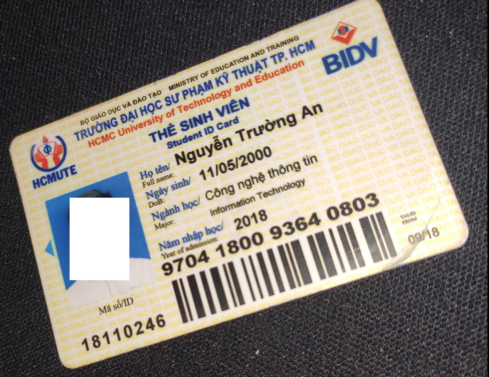
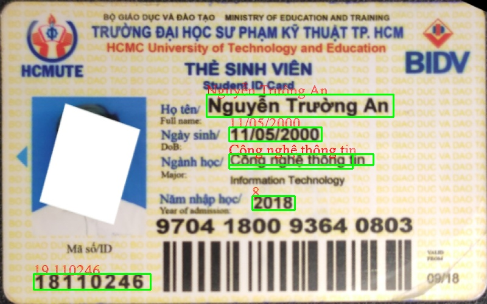
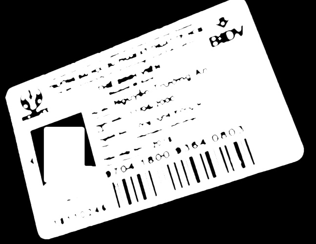
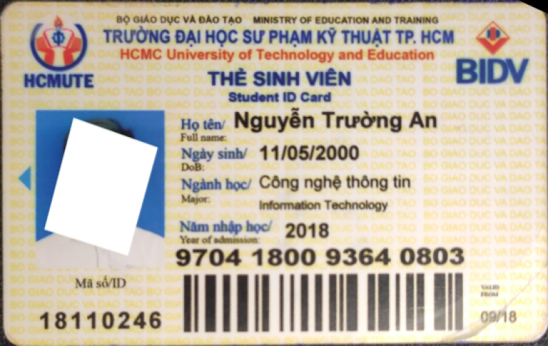
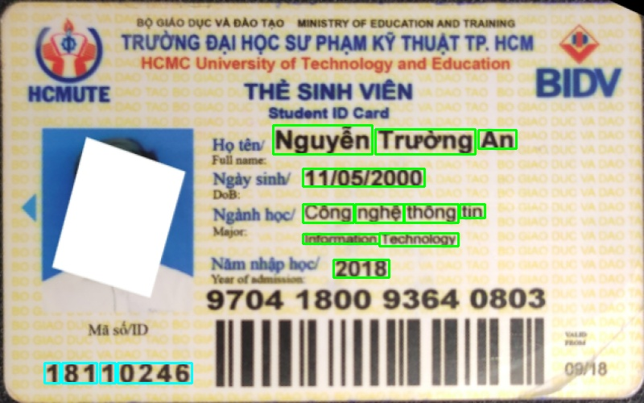

# Student id card extraction

| Input  |  Output |
|---|---|
|   |   |

## Processing
Object detection, image processing, optical character recognition put together to build this repository.
### 1. Card detection task

To determine where is the id card located, we inherited from [this](https://github.com/mesutpiskin/id-card-detector) repository. 
### 2. Align id card

| Id card  |  Aligned |
|---|---|
|   |   | 

### 2. Locate text area

| Aligned  |  Kmean | Contours | 
|---|---|---|
|   |   | 

# Usage

Open full_stack.py and change filename in [this line](https://github.com/ntruongan/Student-id-card-extraction/blob/442556797920fd7a2168af868894fa1adece507a/full_stack.py#L620) - filename locate in /test_images/

